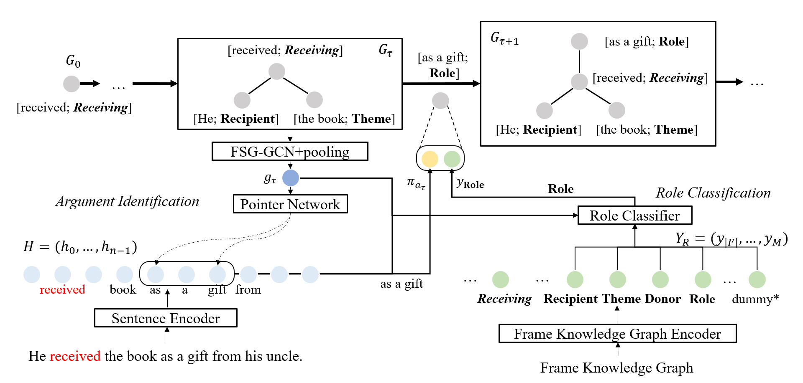

# KID
Source code for "A Double-Graph Based Framework for Frame Semantic Parsing" @ NAACL 2022
## Overview
TL;DR: A framework for frame semantic parsing aims to utilize double-graph structure to inject knowledge into parsing and strengthen interacrions between arguments.

Paper Link: [A Double-Graph Based Framework for Frame Semantic Parsing](https://openreview.net/pdf?id=STUnTbwKMXm), TODO: this is early version of our paper, we will replace it with camera-ready version soon.

We find ontological frame knowledge can contribute to frame semantic parsing by both intra-frame and inter-frame reasoning. To make use of it, we build FKG (Frame Knowledge Graph) on definitions of FEs, frame relations and FE mappings. Besides, We regard frame semantic parsing as a process to add nodes in FSG (Frame Semantic Graph) incrementally, which can strengthen relations beween arguments and interactions of subtasks in frame semantic parsing. 

<div align=center>

</div>

## Requirements

## How to Run Our Code?
### Datapreprocess
You can get some data files from scratch, we will also provide [links](https://drive.google.com/drive/folders/1MRqhlWwHsAVnwH-HUb8990nTasvkK-fR?usp=sharing) to download remaining data files.


#### Data Folder Structure

Please make sure your data folder structure as below.
```
.
├── dev_instance_dic.npy
├── exemplar_instance_dic.npy
├── fe_label_to_dict.npy
├── fn1.5
│   └── conll
│       ├── dev
│       ├── exemplar
│       ├── frames
│       ├── test
│       └── train
├── fndata-1.5
│   └── ...
├── frame-fe-dist-path
│   ├── fe_dis_matrix.npy
│   ├── fe_hash_idx.npy
│   ├── fe_path_matrix.npy
│   ├── frame_dis_matrix.npy
│   ├── frame_hash_idx.npy
│   └── frame_path_matrix.npy
├── glove.6B.200d.txt
├── graph
│   ├── frame_fe.npz
│   ├── frame_frame.npz
│   ├── inter_fe.npz
│   ├── intra_fe.npz
│   └── self_loop.npz
├── intra_frame_fe_relations.npy
├── parsed-v1.5
│   ├── FE.csv
│   ├── feRelations.csv
│   ├── frame.csv
│   ├── frameRelations.csv
│   ├── fulltext
│   ├── LU.csv
│   └── ...
├── test_instance_dic.npy
└── train_instance_dic.npy
```


TODO: replace them with one single shell `data_preprocess.sh`

Run `data_preprocess.py` to get data_instance_dic and word/lemma vectors from [GloVe](https://nlp.stanford.edu/projects/glove/).
```
python data_preprocess.py
```

Then run `dep_parsing.py` to build dependency trees for each sentence. This will modify data_instance_dic produced by `data_preprocess.py`, and we **DO NOT** parse exemplar_instance_dic because it will take a lot time. You can modify dep_parsing.py to parse exemplar_insrtance_dic if you want to pretrain on exemplar sentences.
```
python dep_parsing.py
```

Run `build_fe_name_dict.py` to get fe_label_to_name.npy which stores a dict to map FE id to their name.
```
python build_fe_name_dict.py
```

Run `parse_fe_xml.py` and `rel_graph_construct.py` to build adj matrix for FKG.
